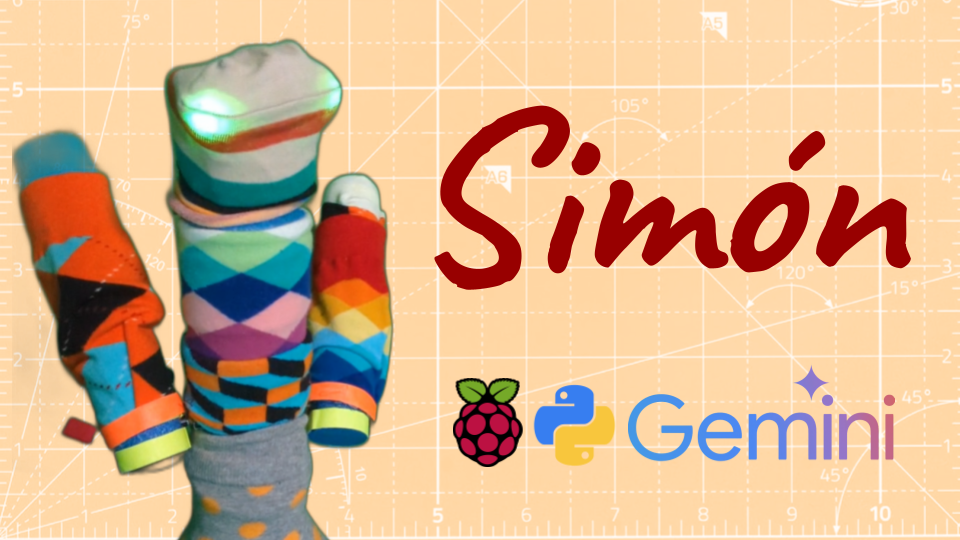

# 🧦 Simón 🎶 🧦

Simón is a robotic children's toy that uses multimodal input (audio, video, image) to interact with customizable servos and LED lights. It is powered by the [Gemini API](https://ai.google.dev/competition) as part of the [2024 Gemini API Developer Competition](https://ai.google.dev/competition) using tool calling to asynchronously run robot behaviors which can be generated by ai. Young children can play a game of "Simon Says" with a small foam robot. Older children can use this codebase and documentation to make their own robot at home. Checkout the full [🛠️ BUILD GUIDE 🏗️](docs/BUILDGUIDE.md) to build your own, all code is MIT licensed.

[📊🗳️ Vote for Simón 🗳️📊]()

## Updates

- [09/12/2024] Submitted to the [2024 Gemini API Developer Competition](https://ai.google.dev/competition)
- [09/09/2024] Livestream project presentation on [YouTube](https://youtube.com/live/qd3x_OXqPz8).

## Videos

[](https://youtube.com/live/qd3x_OXqPz8)

## 🛠️ BUILD GUIDE 🏗️

- [Gemini API](docs/BUILDGUIDE.md#gemini)
    - [API Key](docs/BUILDGUIDE.md#gemini.api_key)
    - [Testing Gemini](docs/BUILDGUIDE.md#gemini.testing)
    - [Vision and Audio](docs/BUILDGUIDE.md#gemini.vision)
    - [Tool Generation](docs/BUILDGUIDE.md#gemini.toolgen)
- [Hardware](docs/BUILDGUIDE.md#rpi)
    - [Pinout](docs/BUILDGUIDE.md#pinout)
    - [Servos and LEDs](docs/BUILDGUIDE.md#servo-led)
    - [Power](docs/BUILDGUIDE.md#power)
    - [Touchscreen Display](docs/BUILDGUIDE.md#touchscreen)
    - [Camera](docs/BUILDGUIDE.md#camera)
    - [Microphone](docs/BUILDGUIDE.md#microphone)
    - [Simón](docs/BUILDGUIDE.md#simon)
- [Software](docs/BUILDGUIDE.md#software)
    - [Operating System](docs/BUILDGUIDE.md#os)
    - [Python](docs/BUILDGUIDE.md#python)
- [Extras](docs/BUILDGUIDE.md#extras)
    - [Help Chat](docs/BUILDGUIDE.md#extras.helpchat)
    - [Voice Generation](docs/BUILDGUIDE.md#extras.voicegen)
    - [Music Generation](docs/BUILDGUIDE.md#extras.musicgen)
    - [Image Generation](docs/BUILDGUIDE.md#extras.imagegen)
- [Safety](docs/BUILDGUIDE.md#safety)
- [BOM](docs/BUILDGUIDE.md#bom)

## Citation

If you use this code or project for your own projects, please cite it as:

```
@misc{simon-2024,
  title={Simón: Open Source Robot Toy Powered by Gemini API},
  author={Hugo Ponte},
  year={2024},
  url={https://github.com/hu-po/simon}
}
```
