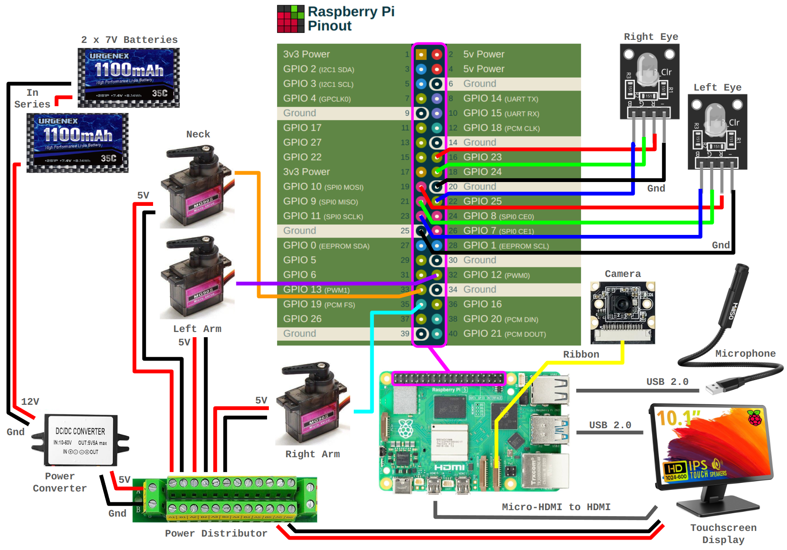
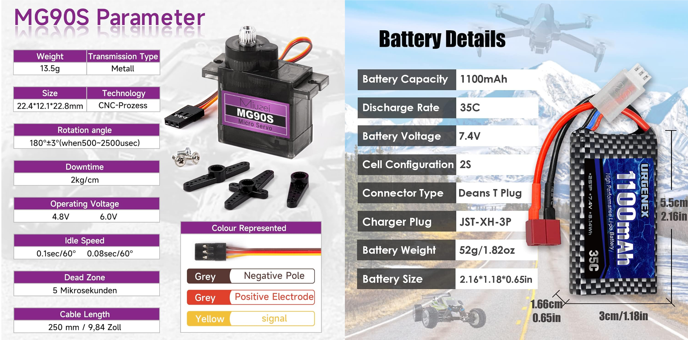
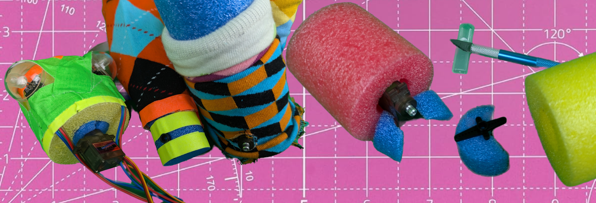
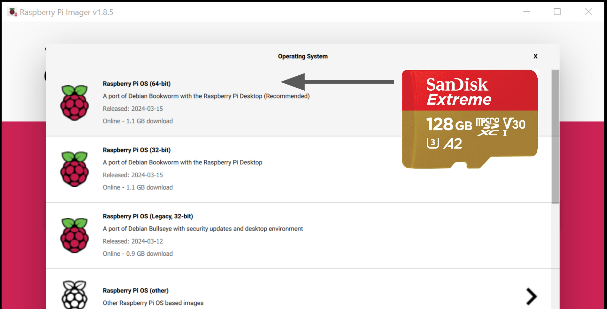

# 🛠️ BUILD GUIDE 🏗️

Welcome to the _Simón_ Build Guide! This guide will walk you through the process of building and programming your own _Simón_. This project is not just a destination, it is also a fun and educational way to teach children about robotics, AI, and programming. If your child is old enough to participate in the building process, I highly recommend it. If not, the final product is designed to be safe and easy to use for children of all ages.

- [Gemini API](#gemini)
    - [API Key](#gemini.api_key)
    - [Testing Gemini](#gemini.testing)
    - [Vision and Audio](#gemini.vision)
    - [Tool Generation](#gemini.toolgen)
- [Hardware](#rpi)
    - [Pinout](#pinout)
    - [Servos and LEDs](#servo-led)
    - [Power](#power)
    - [Touchscreen Display](#touchscreen)
    - [Camera](#camera)
    - [Microphone](#microphone)
    - [Simón](#simon)
- [Software](#software)
    - [Operating System](#os)
    - [Python](#python)
- [Extras](#extras)
    - [Help Chat](#extras.helpchat)
    - [Voice Generation](#extras.voicegen)
    - [Music Generation](#extras.musicgen)
    - [Image Generation](#extras.imagegen)
- [Safety](#safety)
- [BOM](#bom)

## Gemini API <a name="gemini"></a>

### API Keys <a name="gemini.api_key"></a>

To use the Gemini API you will first need to [get an API key from here](https://aistudio.google.com/app/apikey). Paste this key into your `~/.bashrc` file as an environment variable like so:

```bash
echo "export GEMINI_API_KEY=YOUR_API_KEY" >> ~/.bashrc
```

### Testing Gemini <a name="gemini.testing"></a>

To verify that the API key is set correctly, run the `app-test-gemini.py` script. This will launch a gradio app that allows you to test the available models and how they interpret multimodal input to choose a tool.

```bash
python app-test-gemini.py --debug
```

In the testing app, you can take (1) take an image, (2) record audio, or (3) record video. The app will then send this data to Gemini and choose one of the following tools:

```python
# ---- TOOLS 🛠️ ----

def shaka_sign() -> str:
    """Does the shaka sign.
    
    Returns:
        str shaka sign emoji
    """
    return '🤙'

# tools can be async or not
async def thumbs_up() -> str:
    """Does the thumbs up.
    
    Returns:
        str thumbs up emoji
    """
    return '👍'

# ---- TOOLS 🛠️ ----
```

See if you can get it to execute the correct function!

Code for each modality (image, audio, video) and gemini itself are implemented as a single file python module in the `simon` directory. You can modify the config settings for each modality by changing the default values in the config dataclasses located in each module. Every module has its own emoji.

```python
@dataclass(kw_only=True)
class CameraConfig(BaseConfig):
    name: str
    emoji: str = "📸"
```

### Function Generation <a name="gemini.toolgen"></a>

You can generate new tool functions for Simón using the Gemini API:

```bash
cd ~/simon
python scripts/generate_tools.py app-simon-says.py
```

Copy-paste them back into the tools section of `app-simon-says.py`.

### Vision and Audio <a name="gemini.vision"></a>

According to the Gemini API documentation, [images are upscaled](https://ai.google.dev/gemini-api/docs/vision?lang=python#technical-details-image) to `768x768` or downscaled to `3072x3072`. Our raspberry pi camera can take images up to a resolution of `3280x2464`. A higher resolution image will take longer to encode, send, decode, inference. But a higher resolution image will also result in a more intelligent and accurate model response. Therefore we choose a resolution of `2400x2400` for the images.

According to the Gemini API documentation, [audio is downscaled](https://ai.google.dev/gemini-api/docs/audio?lang=python) to `16Kbps`. We choose a default audio length of `4` seconds on a mono channel.

## Hardware <a name="hardware"></a>

### Pinout <a name="pinout"></a>

Here is the full pinout for Simón, we will make references to it throughout the hardware section of this guide.



You can use [this website](https://pinout.xyz/) to see more information on each of the pins. Once you are finished with the wiring, make sure to update the pin numbers in `simon/__init__.py` to match your wiring:

```python
c['gpios'] = GPIO([
    ServoConfig(name="head.yaw", pwm="pwm1.a", pin=13),
    ServoConfig(name="arm.left", pwm="pwm0.a", pin=12),
    ServoConfig(name="arm.right", pwm="pwm1.b", pin=19),
    LEDConfig(name="eye.left", r_pin=23, g_pin=24, b_pin=25),
    LEDConfig(name="eye.right", r_pin=10, g_pin=9, b_pin=11),
])
```

### Servos and LEDs <a name="servo-led"></a>

For this project we will be using [MG90S](https://amzn.to/3WqkfsN) servos. These servos are small and cheap, making them safe for children. The MG90S use higher quality components than the utra-cheap `SG90`, making them more reliable and durable. These are `5V` servos and will be controlled via PWM signals from the Raspberry Pi. The Raspberry Pi has four dedicated hardware PWM pins. Servos can jitter if the PWM signal is not stable, so we will use the hardware PWM pins for servos and the software PWM pins for the LEDs.

For this project we will use [RGB LED modules](https://amzn.to/46rQCvK). These LEDs are small and cheap and have four cables: `R`, `G`, `B`, and `GND`. The `R`, `G`, and `B` cables are connected to the Raspberry Pi's GPIO pins. The `GND` cable is connected to the Raspberry Pi's ground. The LEDs will be controlled via software PWM signals from the Raspberry Pi.

To verify the servos and leds are working correctly, run the `app-test-gpios.py` script. This will launch a gradio app that allows you to test the servos and leds.

```bash
python app-test-gpios.py --debug
```

### Power <a name="power"></a>

To power the project we will use two [7.4V 1100mAh batteries](https://amzn.to/3Suggud) connected in series to a [power distributor](https://amzn.to/3Yp4FQW) that convert the voltage to `5V` with a maximum of `5A` for the Raspberry Pi and all the hardware components. See the [pinout](#pinout) for the correct wiring. Some information on the batteries and servos:



Note that `5A` might be too much for an rpi less than version 5.

### Touchscreen Display <a name="touchscreen"></a>

For this project we use a [Touchscreen Display](https://amzn.to/4c5rbkU) that connects to the Raspberry Pi via HDMI and USB. This will let us interact with the various Simón apps.

### Camera <a name="camera"></a>

We will be using a [RPi Camera Module](https://amzn.to/4fp3IOt) to take our images. Connect the camera to the Raspberry Pi using the ribbon cable to the `CSI` port on the Raspberry Pi. To test the camera, use the `test_camera_app.py` script.

```bash
python test_camera_app.py --debug
```

### Microphone <a name="microphone"></a>

The microphone is a small [USB 2.0 gooseneck microphone](https://amzn.to/4djG3gL) connected to the Raspberry Pi. Bend the microphone wire to face the user to get the best audio quality. Test the microphone using the `test_audio_app.py` script.

```bash
python test_audio_app.py --debug
```

### Simón <a name="simon"></a>



The robot body of Simón is made from foam and colored tape. I used a hobby knife to cut the foam and tape. The servos are wedged into the foam noodles using smaller cut foam pieces. Socks go over the noodles to give Simon a more cuddly feel. The LEDs are covered with plastic half-spheres and taped on.

## Software <a name="software"></a>

### Raspberry Pi OS <a name="os"></a>

We will be using a `Raspberry Pi 5` for this project, you can also use a 4 or likely even older. We will be using the `Raspberry Pi OS (64bit)` OS on the pi, which needs to be flashed onto an microSD card. I am using a `SanDisk 128GB` card, link in the [BOM](#bom). On a desktop PC or laptop, download the "Raspberry Pi Imager" from the [Raspberry Pi website](https://www.raspberrypi.org/software/). Follow the instructions to flash the OS on the card. I set the username to `rpi5` or `rpi4` depending on the model.



Insert the microSD card into the Raspberry Pi and boot it up. Open up a terminal with `Ctrl + Alt + T` and set the following config options:

```bash
sudo raspi-config
```

- [8. Update] > [Update all software]
- [2. System Options] > [S5 Boot / Auto Login] > [B4 Desktop Autologin]
- [3. Interface Options] > [P1 Camera] > [Yes]

We will use Gradio in combination with a Chromium browser to display a UI. First install the browser:

```bash
sudo apt-get install chromium-browser
```

We also need to install a library to display emojis:

```bash
sudo apt-get install fonts-noto-color-emoji
```

### Python <a name="python"></a>

This project uses Python as the main programming language. First ensure the rpi is connected to the internet. Then download the repo from github into the home directory:

```bash
cd ~
git clone https://github.com/hu-po/simon.git
cd simon
```

Create a virtual python environment inside repo:

```bash
python3 -m venv simon-venv
source simon-venv/bin/activate
```

Add it to your `~/.bashrc` file so it runs on boot. This will ensure that every time the rpi boots up the virtual environment is activated:

```bash
echo "source ~/simon/simon-venv/bin/activate" >> ~/.bashrc
```

Install python dependencies.

```bash
pip install -r requirements.txt
```

If you do not have a raspberry pi and prefer `conda` (maybe you simply want to test the Gemini API functionality), run the following commands to create a conda environment:

``` bash
conda create -n simon python=3.11
conda activate simon
pip install -r requirements.txt
```

This repo makes heavy use of Python's [async library](https://docs.python.org/3/library/asyncio-task.html#id6) to run multiple tasks concurrently. This allows us to do things while we wait for the Gemini API to answer.

The project has been designed to be modular and easy to test. Each seperate functionality has its own test UI. To run each of the test modules, you can use the following command. Use the `--debug` flag to enable debug logging (more prints).

```bash
python app-test-gemini.py --debug
```

Try more from the following list of all modules testers:

- `app-test-gemini.py` - Test the Gemini API (audio, images, video, and tool use).
- `app-test-audio.py` - Test the audio playback and speakers built into the screen.
- `app-test-camera.py` - Test the PiCamera in both image and video mode.
- `app-test-gpios.py` - Test the GPIO devices: Servos, LEDs, etc
- `app-test-screen.py` - Test the basic Chrome UI using Gradio.

The main code is inside the `simon` directory. The `simon/__init__.py` file contains the main configuration for the robot.

## Extras <a name="extras"></a>

### Help Chat <a name="extras.helpchat"></a>

If you need help during the project, the `docs/ask_gemini.py` script will create let you ask questions using the [Gemini API](https://ai.google.dev/gemini-api/docs) which will have this build guide for context. To run the chatbot, use the following command:

```bash
python docs/ask_gemini.py
```

### Voice Generation <a name="extras.voicegen"></a>

Voices are generated using [openai's tts playground](https://platform.openai.com/playground/tts), more info can be found here [openai's tts api](https://platform.openai.com/docs/guides/text-to-speech). There is also a script to auto-generate voices for the project:

```bash
cd ~/simon
python scripts/generate_tts.py
```

### Music Generation <a name="extras.musicgen"></a>

All music is made specifically for this project and is generated using [udio](https://www.udio.com/).

### Image Generation <a name="extras.imagegen"></a>

Images are generated using [RunwayML](https://platform.openai.com/docs/guides/image-generation). Runway was also used as the video editor for the submission video.

## Safety <a name="safety"></a>

Some notes on safety:
 
- There are some small parts in this project that could be a choking hazard for small children. I recommend using tape to cover the servo screws and other small parts.
- The batteries and servos can overheat, make sure to keep an eye on them. If they are hot to the touch, turn off the robot and let it cool down.
- Careful to not block the servo's movement or they will heat up and potentially break.
- If you do not provide a stable enough power supply the rpi will shut down.

## Bill of Materials <a name="bom"></a>

The list of parts used for building your own Simón. Note that prices will differ depending on your location. The total cost for this project is less than __300$__.

| Item              | Quantity | Price ($) |
| :---------------- | :------: | ----: |
| [MG90S Servo](https://amzn.to/3WqkfsN)    |   3   | 2.99 |
| [RGB LED Module](https://amzn.to/46rQCvK)    |   2   | 0.99 |
| [MicroSD Card](https://amzn.to/3SufY6B)    |   1   | 15.99 |
| [Raspberry Pi 5](https://amzn.to/4dlZMMy)    |   1   | 69.99 |
| [Power Converter](https://amzn.to/4c3Pcsw)    |   1   | 13.99 |
| [Battery 7.4V 1100mAh](https://amzn.to/3Suggud)    |   1   | 23.99 |
| [Power Distributor](https://amzn.to/3Yp4FQW)    |   1   | 8.99 |
| [USB Microphone](https://amzn.to/4djG3gL)    |   1   | 9.99 |
| [RPi Camera Module](https://amzn.to/4fp3IOt)    |   1   | 11.99 |
| [Touch Screen](https://amzn.to/4c5rbkU)    |   1   | 109.99 |
| [Foam Noodles](https://amzn.to/4fm2VxY)    |   1   | 14.99 |
| [Colored Tape](https://amzn.to/3St7DQq)    |   1   | 10.99 |